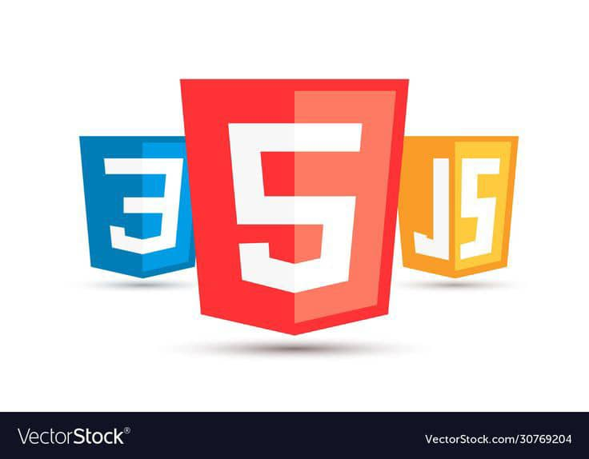
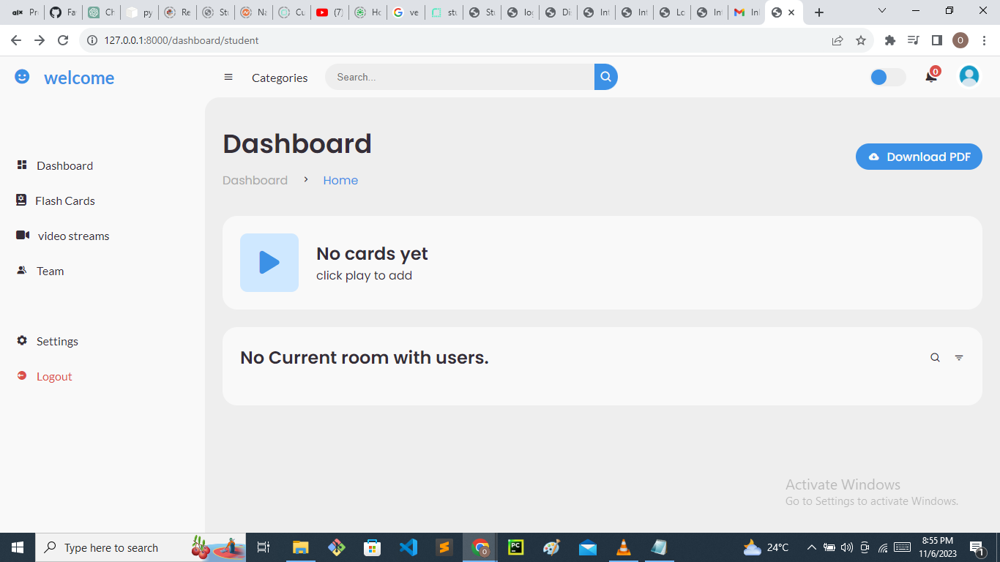
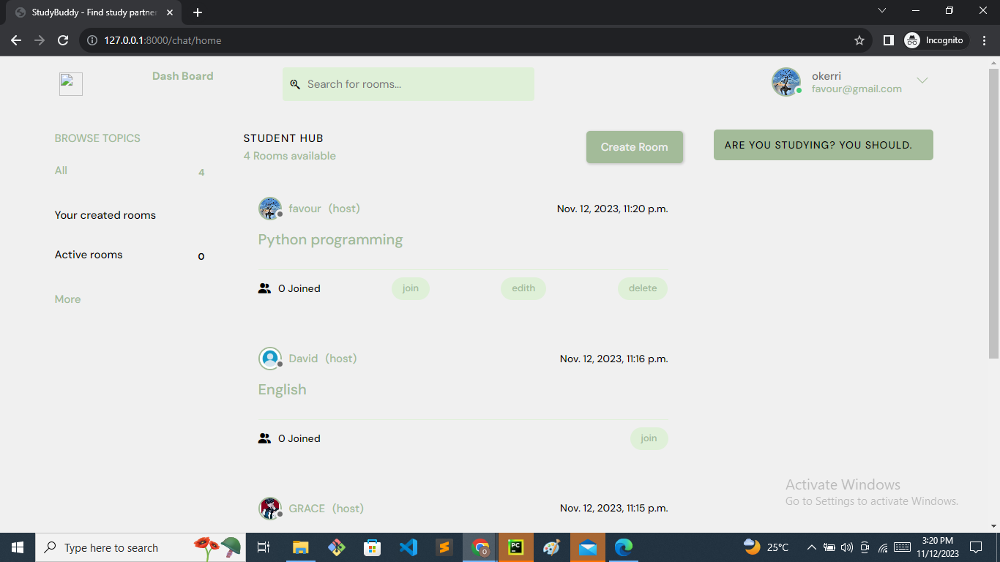

### Student hub

## Table of content
- [introduction](#introduction)
- [technologies](#technologies)
- [key-features](#key-features)
- [Acknowledgments](#acknowledgments)
- [view](#view)

## Introduction
Student Hub is a student-centric app designed to streamline the learning experience. With Student Hub, students can effortlessly create and manage their personalized flashcards, facilitating efficient study sessions. The app not only simplifies the flashcard creation process but also provides a collaborative learning environment by offering video rooms where students can join virtual study sessions, ask questions, and share insights with their peers. 

## TECHNOLOGIES
Backend:

1. **Python Django**: Our project's backend is powered by Python and Django, a robust and versatile programming language and web framework that handles data processing, business logic, and the overall server-side functionality.
JavaScript: While most of the application's back end logic are handeled by python, we utilized a minimal amount of javascript for sending products to our backend for processing.

Frontend:
1. **HTML (HyperText Markup Language)**: Our frontend is built using HTML to structure the content and provide a solid foundation for the web pages.
2. **CSS Cascading Style Sheets**: CSS is used to style and format the HTML elements, ensuring an appealing and consistent design throughout the application.

2. **javascript**: js was used to make user experiennce more intaractive.

This combination of technologies enables us to create a well-rounded and user-friendly web application, with Python Django handling the backend functionality and HTML, CSS, and a touch of JavaScript powering the frontend to deliver a seamless user experience.

## Key-Features:

1. **User Authentication:**
   - Provide user registration and login functionality, allowing users to create accounts and save their information.

2. **Flashcard Creation and Management:**

    Enable users to easily create, customize, and manage their own flashcards for effective learning.

3. **Interactive Video Streams:**
Provide a platform for users to create and join interactive video streams for collaborative learning sessions.

## Acknowledgments:

I would like to express my gratitude to the following technologies and resources that have been instrumental in the development of this e-commerce website:

1. **Python:** The core programming language that powers the backend of this project. Python's versatility and extensive libraries have greatly contributed to the development process.

2. **Django:** A powerful and versatile web framework that played a fundamental role in building the structure and functionality of this website. Django's built-in features, such as authentication and ORM, have been invaluable.

3. **HTML and CSS:** The backbone of the website's user interface. HTML for structuring content and CSS for styling have enabled us to create an appealing and user-friendly design.

4. **JavaScript:** Used to enhance user interactivity and deliver dynamic features on the website. JavaScript libraries and frameworks have facilitated a smoother user experience.

I would also like to extend my appreciation to the broader web development community, forums, and documentation sources that have been invaluable throughout this project. Your open-source contributions and online discussions have been a constant source of inspiration and knowledge.

## view
1. **Dashboard**:
    

2. **video room**:
    
